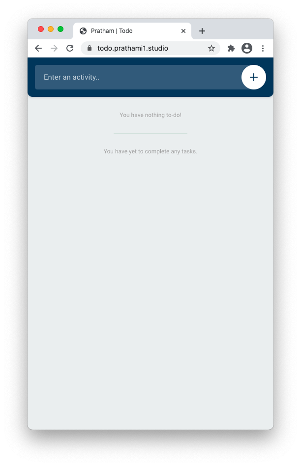
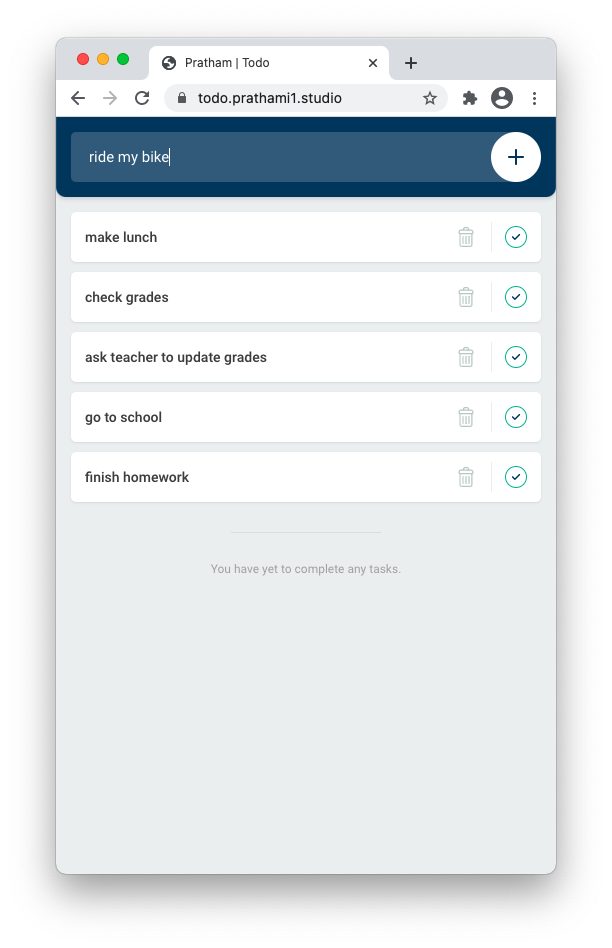
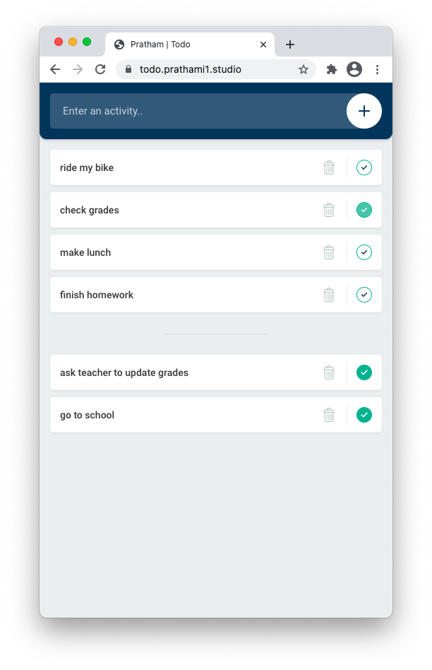
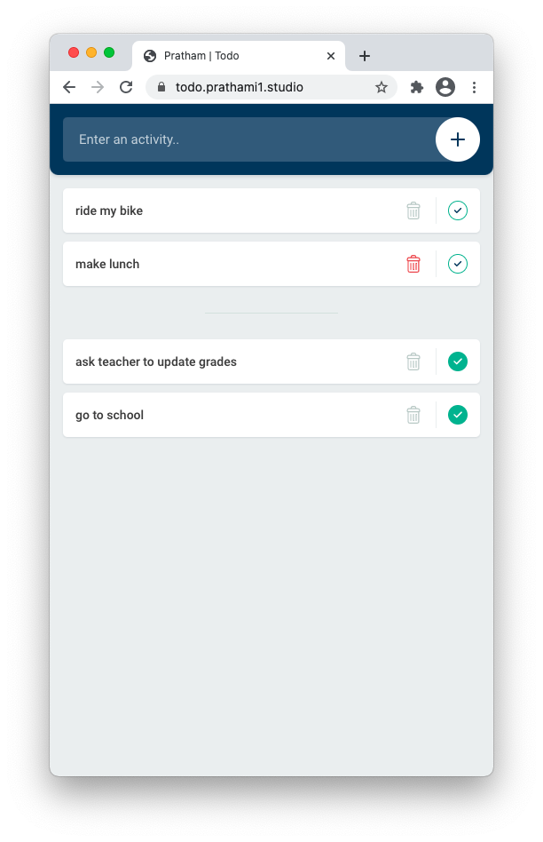

# Web Projects
A compilation of all of my web projects developed throughout the course of my high school career.

Projects Include:
- [Tic Tac Toe](https://prathami1.github.io/tic-tac-toe/)
- [Weather](https://prathami1.github.io/weather-js)
- [Todo List](https://prathami1.github.io/todo/)
- [Snake](https://prathami1.github.io/snake-js/)

## Tic Tac Toe (Multiplayer)
Simple grid based game for multiplayer use. Built and written in Javascript, and styled in CSS.

### Gameplay


## Weather App
Weather App written with Javascript utilizing Darksky's API. May lose support once Apple terminates Darksky's API's services. 
Built using pure HTML, CSS, and Java Script.

***Update: Application and API are no longer in service due to Apple-Dark Sky acquisition.***

## Todo List
Simple to-do list web application, written in HTML and Java Script, and styled in CSS.  Features a simple material UI design and a function to show completed tasks.

### Progressive Web Application
Supports app use and is mobile friendly, despite being hosted on the web. Works both on desktop and mobile, with syncronization compatibility coming soon!

### Application in action
Detailed below are screenshots of the application in action, highlighting its functionality.

|  Application Greeting    | Entering Tasks            |  Managing Tasks           | Deleting Tasks
:-------------------------:|:-------------------------:|:-------------------------:|:-------------------------:
  |  |  | 

### Dependencies and Frameworks Utilized 
- Javascript (backend)
- HTML (Backbone)
- CSS (Styling)

## Snake
The game Snake implemented with functional style in JavaScript without libraries. Interfaces for browsers and terminals.

### Usage
```bash
git clone git@github.com:prathami1/web-projects/snake.git
cd snake
node cli
```

### Gameplay

- Use arrow keys, wasd, or hjkl to control the snake.
- Collect apples.
- Avoid crashing.
- Ctrl-c to quit (in terminal).
