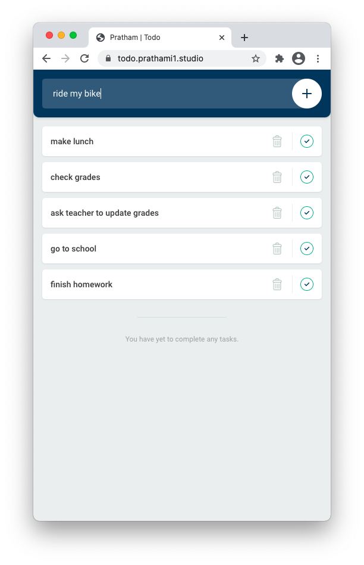
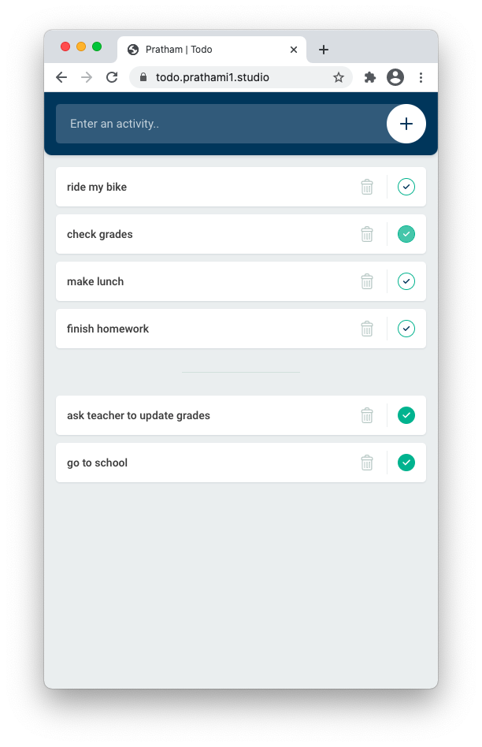
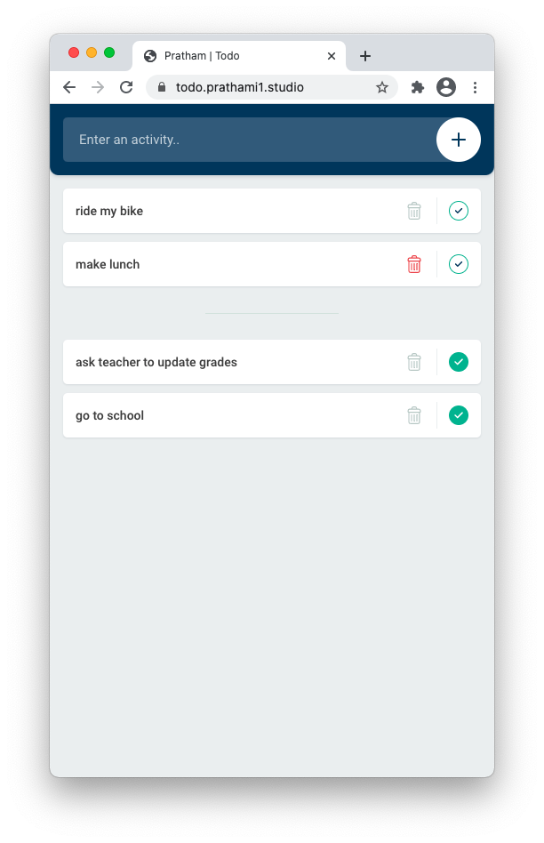

# Todo List
Simple to-do list web application, written in HTML and Java Script, and styled in CSS.  Features a simple material UI design and a function to show completed tasks.

## Progressive Web Application
Supports app use and is mobile friendly, despite being hosted on the web. Works both on desktop and mobile, with syncronization compatibility coming soon!

## Application in action
Detailed below are screenshots of the application in action, highlighting its functionality.

|  Application Greeting    | Entering Tasks            |  Managing Tasks           | Deleting Tasks
:-------------------------:|:-------------------------:|:-------------------------:|:-------------------------:
  |  |  | 

## Dependencies and Frameworks Utilized 
- Javascript (backend)
- HTML (Backbone)
- CSS (Styling)
